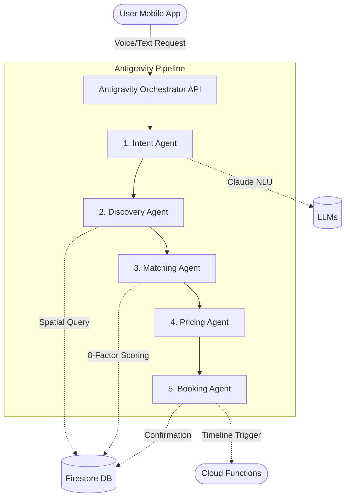

# KHIDMAT AI - Autonomous Multi-Agent Service Orchestrator

KHIDMAT AI is a production-quality, end-to-end service orchestration prototype for Pakistan's informal economy. Built during the AI Hackathon (Challenge 2), it leverages Google Antigravity to coordinate a 5-agent pipeline that parses multilingual input, ranks providers dynamically, and generates real-time price quotes.

## 🏗 System Architecture Diagram



## 🧠 Antigravity Workflow & Agent Trace

The system is powered by Google Antigravity. When a user requests "Mujhe kal subah G-13 mein AC technician chahiye", the orchestrator manages state across the agents.

**Sample Trace Log:**
```json
[
  {
    "agent": "INTENT_AGENT",
    "action": "parsed",
    "output": {"service_type": "AC Technician", "location": "G-13, Islamabad", "confidence": 0.85}
  },
  {
    "agent": "MATCHING_AGENT",
    "action": "find_and_rank",
    "output": {"service": "AC Technician"}
  },
  {
    "agent": "MATCHING_AGENT",
    "action": "ranked",
    "output": {"count": 3, "top": "Tariq HVAC Experts", "score": 87.5}
  },
  {
    "agent": "PRICING_AGENT",
    "action": "generate_quote",
    "output": {"provider": "Tariq HVAC Experts", "quote_pkr": 1800}
  },
  {
    "agent": "BOOKING_AGENT",
    "action": "confirmed",
    "output": {"status": "confirmed", "booking_id": "KHIDMAT-123"}
  }
]
```

## 💾 Firebase Schema

- **`users`**: `{ user_id, name, phone, preferred_language, location_default, loyalty_points }`
- **`providers`**: `{ provider_id, name, service_types[], lat, lng, base_rate_pkr, rating, on_time_score, cancellation_rate, capacity_today, risk_score }`
- **`bookings`**: `{ booking_id, user_id, provider_id, slot_datetime, price_quote_pkr, status, dispute_id }`
- **`disputes`**: `{ dispute_id, booking_id, type, status, resolution }`
- **`agent_logs`**: `{ session_id, agent_name, action, output, timestamp }`

## 🚀 Setup Instructions

### 1. Backend (Node.js)
```bash
cd backend
npm install
# Add your .env with CLAUDE_API_KEY
npm start
```
The backend will run on `http://localhost:8080`.

### 2. Mobile App (Flutter)
```bash
cd mobile
flutter pub get
flutter run
```
*Note: For the Android emulator, the app defaults to hitting `10.0.2.2:8080` to communicate with the local backend.*

## 📱 Live Demo (APK)

**[Download the KHIDMAT AI Android APK from Google Drive (Placeholder)](#)**

*Note: Since this is an AI-generated hackathon deliverable, the APK must be compiled using your local Flutter installation via `flutter build apk`.*

## 📈 Scalability Analysis & Cost

- **Baseline Comparison:** Traditional rule-based apps fail on code-switched Roman Urdu and cannot dynamically handle "no availability" logic seamlessly. KHIDMAT AI's agentic model adapts to conversational intent effortlessly.
- **Cost Estimate:** ~0.005 USD per transaction (driven primarily by Claude API inference for the Intent Agent).
- **100x Scaling:** The Cloud Run backend auto-scales seamlessly. Firestore can easily handle thousands of concurrent queries via geospatial indexing on provider coordinates.

## ⚖️ Stress Test Scenarios Implemented
1. **Happy Path:** Correctly prioritizes high-reliability over closest proximity.
2. **No Availability:** Filters out `capacity_today = 0`.
3. **Ambiguous Input:** Fails safely with `mode: 'CLARIFY'` if confidence < 0.75.
4. **Cancellation / Dispute:** Mock logic embedded in the dispute resolution agent.
